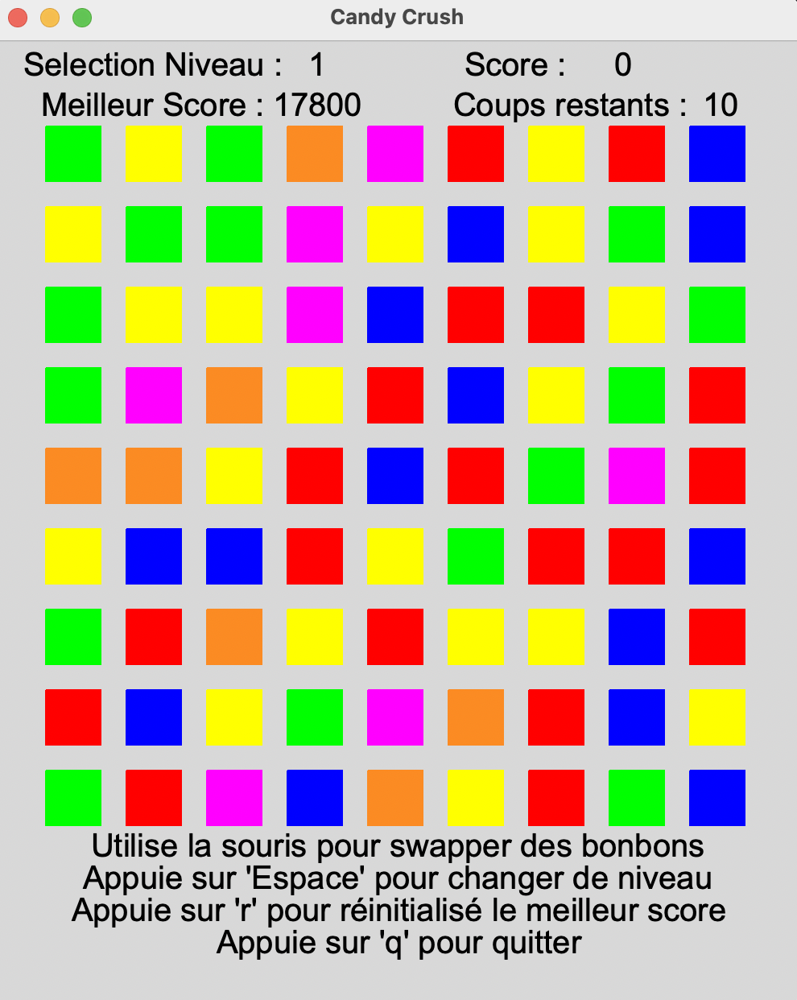

# Rapport Projet inspiré de Candy Crush

## Description du Projet

Ce projet consiste en la création d'un jeu inspiré de **Candy Crush**, implémenté en C++. Le jeu inclut des fonctionnalités telles que :
- La gestion des bonbons, des murs, des glacages et des ingrédients.
- Des animations pour les déplacements et les explosions des bonbons.
- Un système de score et de meilleur score.
- Plusieurs niveaux avec des objectifs spécifiques.

Le projet est structuré selon le modèle **Modèle-Vue-Contrôleur (MVC)**, avec une séparation claire entre la logique du jeu, l'affichage et la gestion des interactions utilisateur.

## Fonctionnalités implémentées

1. **Fonctionnalités de base** : Déplacement des bonbons, combinaisons de 3 bonbons ou plus.
2. **Animations** : Animations lors de la suppression des bonbons.
3. **Murs et glacages** : Obstacles qui affectent le gameplay.
4. **Bonbons spéciaux** : Bonbons avec des effets spéciaux (explosions en ligne, en colonne, etc.).
5. **Score et meilleur score** : Gestion du score et sauvegarde du meilleur score.
6. **Niveaux** : Plusieurs niveaux avec des objectifs différents, y compris des niveaux à ingrédients.

## Fonctionnalités non implémentées

1. **Suggestion de coups** : Pas de système pour suggérer des coups au joueur.
2. **Objectifs spécifiques** : Pas d'objectifs spécifiques pour chaque niveau.
3. **Éditeur de tableau** : Pas de possibilité de créer ou modifier des niveaux manuellement.

## Structure du Projet

### Classes principales

1. **Shapes.hpp** : Contient les classes `Rectangle` et `Circle` pour dessiner les éléments du jeu.
2. **Text.hpp** : Gère l'affichage du texte, notamment pour les ingrédients.
3. **ElementDeJeu.hpp** : Classe abstraite pour les éléments du jeu (bonbons, murs, glacages, etc.).
4. **Animation.hpp** : Gère les animations des éléments du jeu (déplacements, explosions).
5. **Jeu.hpp** : Classe principale qui gère la logique du jeu, les combinaisons, et les interactions.
6. **Score.hpp** : Gère le score, le meilleur score, et le nombre de coups restants.
7. **Afficher.cpp** : Classe responsable de l'affichage du plateau de jeu et des informations de score.
8. **Control.cpp** : Classe qui gère les interactions utilisateur (clics, déplacements, etc.).

### Modèle-Vue-Contrôleur (MVC)

- **Modèle** : La classe `Jeu` gère la logique du jeu et l'état du plateau.
- **Vue** : Les classes `Canvas`, `AfficherScoreAndNb_coups`, et `Menu` sont responsables de l'affichage.
- **Contrôleur** : La classe `ControlJeu` gère les interactions utilisateur et met à jour le modèle en conséquence.

## Logique de jeu

Lorsqu'un joueur démarre le jeu, le plateau est initialisé avec des bonbons et des obstacles. Le joueur peut déplacer des bonbons pour créer des combinaisons. Si une combinaison est valide, les bonbons explosent, les glacages sont affectés, et de nouveaux bonbons tombent pour remplir les espaces vides. Le score est mis à jour en fonction des explosions et des objectifs atteints.

## Score

Le score augmente en fonction des événements suivants :
- **Explosion d'un bonbon normal** : +100 points.
- **Explosion d'un bonbon spécial** : +500 points.
- **Ingrédient atteint le bas du plateau** : +1000 points.
- **Explosion adjacente à un glacage** : +250 points (500 points si les deux niveaux de glacage sont explosés).

## Comment lancer le projet

Pour compiler et lancer le projet, il suffit d'exécuter la commande suivante dans le dossier `V5` :

```bash
make
```

## Capture d'écran du jeu :


## Auteur :
Nicolas Melaerts


